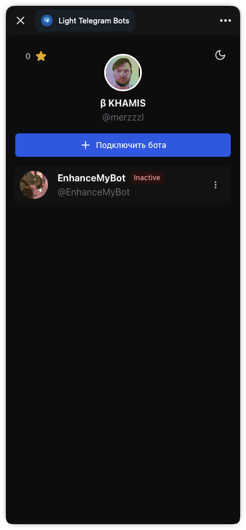
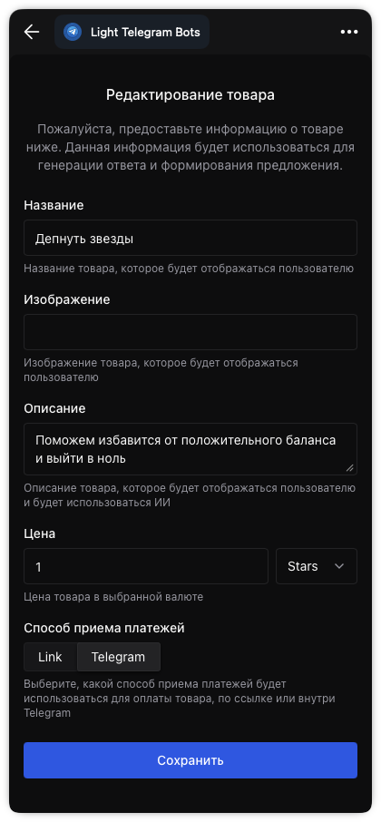
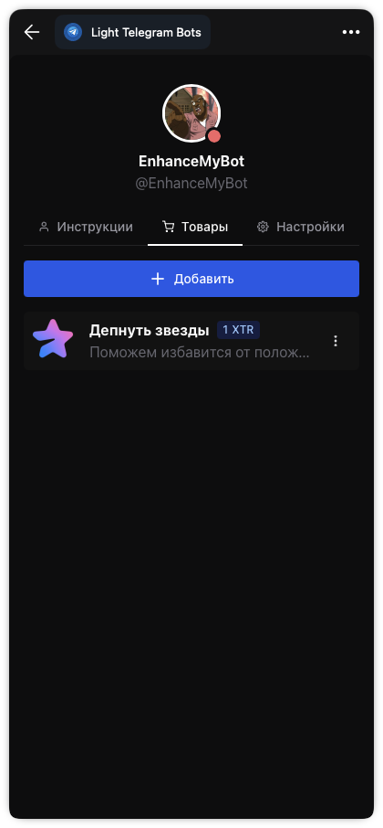

# sale-bot-app

**sale-bot-app** is a Telegram Mini App platform for running AI-assisted sales
bots: connect a bot, configure its agent, manage products/services, and accept
payments inside Telegram.

## What’s inside

- **[Frontend](frontend)** — Telegram Mini App UI (React, Chakra UI, Vite).
- **[Backend](backend)** — AI and Telegram integrations (Go, GORM, SQLite/Postgres).
- **[Contracts / API clients](protocols)** — protobuf, Swagger and Go/TS clients.
- **[Development deployment](compose)** — Docker Compose built from this checkout.
- **[Standalone example](example)** — server installation using published images.

## Architecture

- The **Mini App UI** talks to the **backend API** on the same origin.
- The **backend** integrates with Telegram (bot/webhooks), uses an LLM provider
  for agent responses, and stores data in a database.
- The API surface is defined in **protobuf contracts** and shared across clients.
- One Docker image, `ghcr.io/merzzzl/sale-bot-app`, contains the Go backend and
  compiled Mini App. Caddy provides HTTPS in the Compose deployment.

## Repository map

This monorepo keeps focused components in separate directories:

```text
.github/workflows/  CI and container publication
backend/           Go application and integrations
frontend/          Telegram Mini App UI
protocols/         Contracts and generated Go/TypeScript API clients
compose/           Deployment built from this checkout
example/           Standalone deployment using published images
scripts/           Installer and infrastructure checks
screenshot/        Mini App screenshots
```

The backend uses the local `protocols` Go module through a `replace` directive.
The frontend uses `@sale-bot-app/api` through `file:../protocols`.
No separate API-client release is needed when contracts change.

## Quick start

For server installation without source code, follow
[example/README.md](example/README.md). It requires Docker/Compose and a published
`ghcr.io/merzzzl/sale-bot-app` image. To build from this checkout:

```sh
git clone https://github.com/merzzzl/sale-bot-app.git
cd sale-bot-app/compose
cp .env.example .env
# Fill in your domain, Telegram bot token and OpenAI API key.
docker compose up -d --build
```

See [deployment instructions](compose/README.md) for DNS, HTTPS and persistence.
Configure the main bot's Mini App URL in BotFather to point to your HTTPS domain.

## Development

Requirements: Go matching `backend/go.mod`, Node.js 24, npm, Make, Python 3,
Docker/Compose and a C compiler for SQLite and race-enabled Go tests.

```sh
make install
make check
make build
make docker
```

Both app repositories expose the same commands:

| Command | Purpose |
| --- | --- |
| `make install-go`, `make install-web` | Install dependencies for one stack |
| `make check-go` | Go vet, race-enabled tests and package builds |
| `make check-web` | ESLint, TypeScript and production frontend build |
| `make check-compose` | Compose validation, shell syntax and installer tests |
| `make test`, `make lint` | Run tests or linters separately |
| `make build` | Build `backend/app` and `frontend/dist` |
| `make docker` | Build the single root Dockerfile; override `IMAGE=...` |

The Makefile includes the local Go/TS contracts when `protocols/` is present.
There are no separate component release scripts or component Dockerfiles.

Run the backend from `backend/` with `go run ./cmd/app` after setting the
[environment variables](backend/README.md). It serves the built frontend from
`../frontend/dist` (override with `APP_STATIC_DIR`). For frontend hot reload,
run `npm --prefix frontend run dev`; Vite proxies API/webhook/Telegram requests
to `localhost:8080`.

Regenerate contracts with `make -C protocols generate` (requires protoc,
protoc-gen-go, protoc-gen-go-rest, Docker, and npm).
For rootless Docker, pass `DOCKER_USER=0:0` when regenerating the TS client.

## Container publishing

CI checks backend, frontend and deployment configuration in parallel, then
builds the combined image. The workflow files and Makefile match `wg-easy-app`.

The Publish workflow runs the same CI before publishing to GHCR. It runs on a
published release or manually for the selected branch/tag and image tag.
Images receive a version tag and `sha-<commit>`; stable releases also update
`latest`. Prereleases do not update `latest`. Publication does not create or
overwrite GitHub release descriptions.

See [example/README.md](example/README.md) for image updates, backups and rollback.

TypeScript is kept on 6.0.3, the latest version supported by typescript-eslint.
Existing React Compiler form-state/ref diagnostics are reported as warnings;
frontend lint has no errors. Vite also warns about the existing large UI bundle.

Dependency checks: both npm audits report no known vulnerabilities. Go's
govulncheck reports no reachable vulnerable symbols. It flags GO-2026-6443 in
the indirect gRPC module, but this app does not import the affected server
package; the available fix is currently a development version rather than
a stable release.

## Screenshots

<p>
  
  
  
</p>
